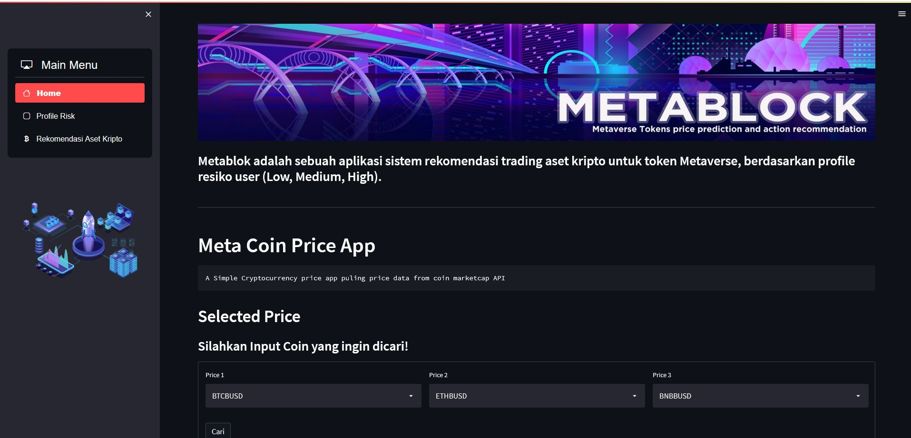
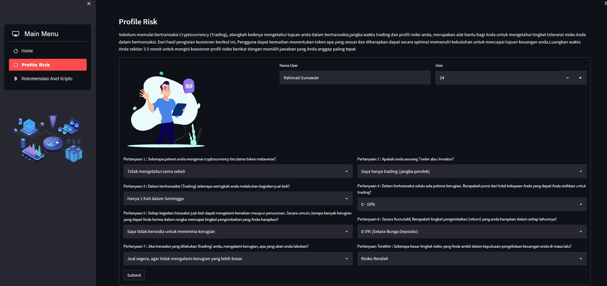
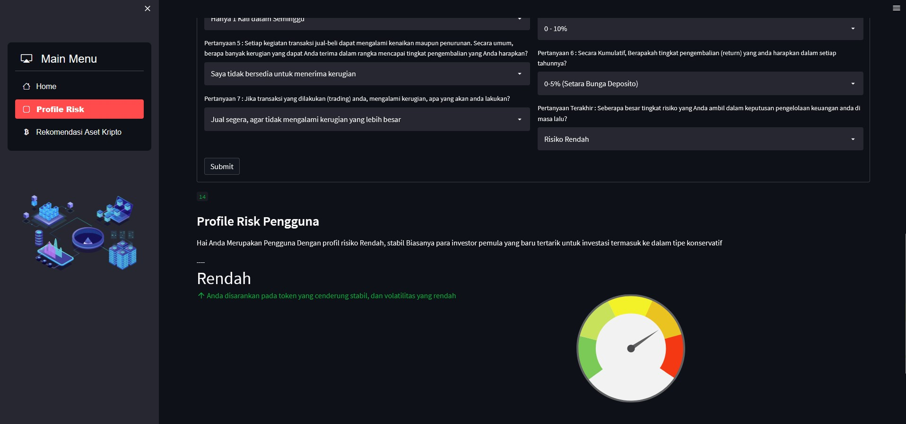
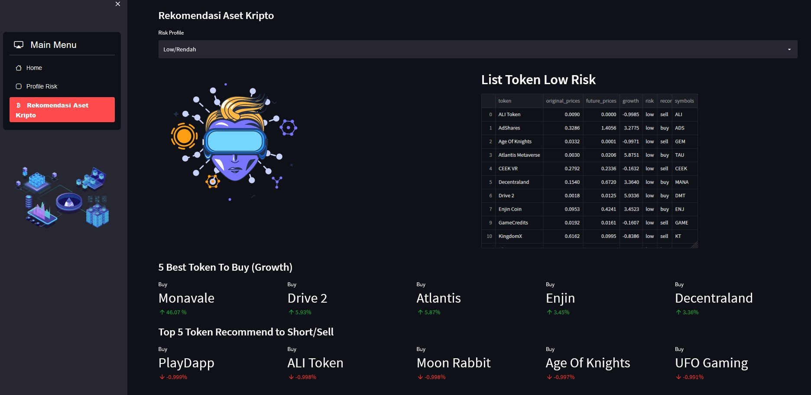
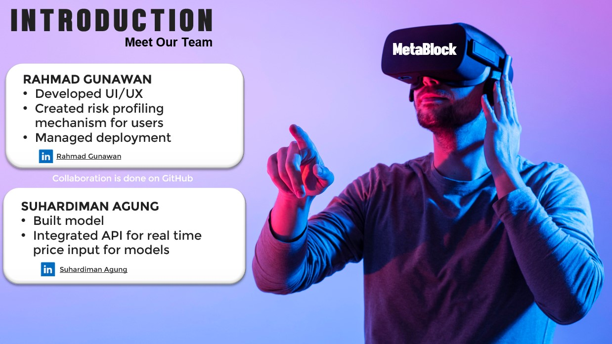
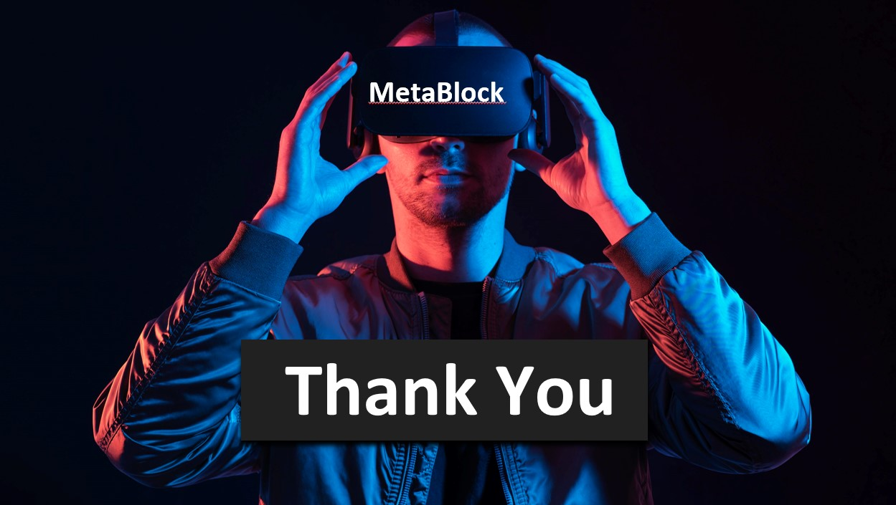

# MetaBlock!
**We Help You Navigate Through The Metaverse With AI**

  

<h1 align="center">Hi Mate👋, We are FTDS Batch 013 Group 1</h1>
<h3 align="center">Meta Block </h3>

By [Rahmad Gunawan](https://www.linkedin.com/in/ragunnn/) and [Suhardiman](https://www.linkedin.com/in/suhardiman-agung-9589ab3a)
## Dashboard

The dataset Metaverse Crypto Tokens Historical data, Top leading and buzzing metaverse tokens

**MetaBlock!** is a crypto asset trading recommendation system application for Metaverse tokens, based on the user's risk profile (Low, Medium, High).

## Introduction

Our app provides AI-based recommendation system to invest in metaversal tokens. Problems that we are trying to solve include:
Metaversal token has high volatility and AI may help in managing investment risk
There are hundreds of metaversal tokens in the market and it is difficult to keep track of those asset classes. AI may help in automating some of the processes and monitoring those coins

There are a high degree of frauds occurring in the metaverse. We help you select tokens that have lower risk

## Application Demo

  
  

  Homepage menu 

  
  

  Homepage menu 

---
Using the application is quite easy, there are 3 navigation pages namely 'Home', 'Profile Risk', and 'Crypto Asset Recommendation' On the Home page, users can find out the price of crypto tokens/coins until now we are still using the Binance API, so it's not just metaverse token but there are also several other coins such as BTC, ETH, etc

Then on the Risk Profile Page, the user will be directed to fill in the user's risk profile, where several questions must be filled in by the user.

The purpose of filling in the risk profile is to identify the user's risk profile, whether it is classified as low, med, or high, after knowing the user's risk profile, we can find out which coins/tokens are suitable/according to the user's risk profile. So that the user will be more comfortable in transacting and then will know how the user's risk profile is, and finally the Crypto Asset Recommendation page, where the user will be given several tokens that match the user's risk profile.

  
  

  Profile Risk Page

  
  

  Profile Risk Page

---

  
  

  Asset Recommendation Page

## Contributor
1. [Rahmad Gunawan, Github (Link)](https://github.com/rahmad07g)
2. [Suhardiman, Github (Link](https://github.com/sumankwan)

  
  

  
  

